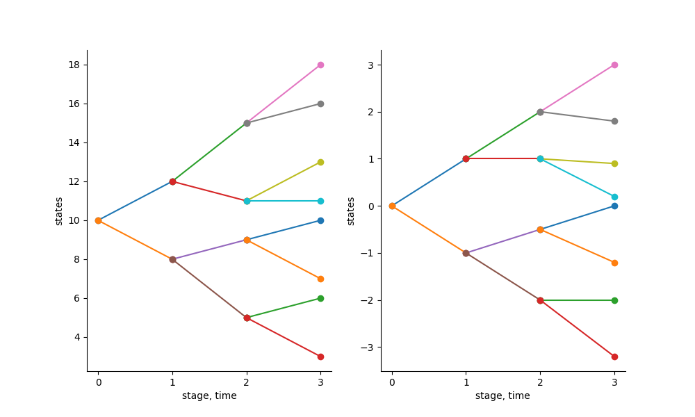

```@meta
CurrentModule = ScenTrees
```

# Scenario Trees

Consider a general stochastic process ``X`` over a discrete time space ``T``, i.e., ``X = (X_0,...,X_T)`` where ``X_0`` is a deterministic starting value and the rest are random values or random vectors whose probability distribution is known. A scenario tree is a discrete time and discrete state process approximating the process `X`. We represent the scenario tree by ``\tilde{X} = (\tilde{X}_0,...,\tilde{X}_T)``. A scenario is a path from the root node to any of the leaves in the tree. The number of stages in a scenario must be equal to the number of stages in a scenario tree which is equal to the length of the sample from the stochastic process ``X``.

A basic scenario tree can be created using the `Tree` function in the package. This function takes the branching structure of the tree and the dimension that you are working on. For example, consider a tree with a branching structure of `1x2x2`. This is a tree with a root in stage `0`, and `2` nodes in stage 1 and each of the `2` nodes in stage one has `2` nodes in stage `2`.

```jldoctest
julia> example1 = Tree([1,2,2],1)
julia> treeplot(example1)
```

The above tree basically is not optimal. This is an example of a beginning tree in stochastic approximation process. we start with a tree like this and then we use samples from a known distribution to improve the tree for a certain number of iterations.


The above tree is in 1-state dimension.
To generate a tree in 2-state dimension, we use the following:

```jldoctest
julia> example2 = Tree([1,2,2],2)
julia> plotD(example2)
```


And in general, we can generate a tree in any `d` state dimension.

## Functions describing a scenario tree

The above tree can described by the following functions: _nodes_, _stages_, _height_, _leaves_ and the _root_ of the tree.

Each tree has stages starting from ``0`` where the root node is.

### Nodes of the tree

This are the vertices that are in the scenario tree. Each node in the tree has a parent node except the root node where the tree starts from. As stated before, each scenario tree is characterized by its name, parents of the nodes , children of each parent nodes e.t.c. So therefore, we have nodes which has parents and those nodes are the children of the parent nodes.

For example,

```julia
julia> nodes(example1)
1:7
```

### Stages of the tree

Each node in a tree is in a specific stage and nodes in the same stage have the same number of children. The stages in a tree starts from `0` where the root node is and ends at stage `T``where the leaf nodes are.

```julia
julia> stage(example1)
0
1
1
2
2
2
2
```

The above example shows that we have 1 node in stage 0, 2 nodes in stage 1 and 4 nodes in stage 2.

### Root of the tree

The root of the tree is the node in which the tree starts from. The root of the tree has no parent; more or less, is the parent of all nodes.

```julia
julia> root(example1)
1-element Array{Int64,1}
1
```

The function `root` can also give us a sequence of nodes to reach a particular node of the tree. It turns out that this function will be very important in stochastic approximation as it will give us a path that we can improve with samples from a stochastic process.

If we want a sequence of nodes to reach, for example, node 6 in the above tree, we just call out the `root``function as follows:

```julia
julia> root(example1,6)
3-element Array{Int64,1}
1
3
6
```

### Leaves of the tree

In each tree, we have the leaves. Leaves are all those in the tree which doesn't have children nodes. They are the terminal nodes in the tree. Our function `leaves` returns the leaf nodes in the tree, their indexes and the conditional probabilities to reach each of the leaves from the root node. Consider the following:

```julia
julia> leaves(example1)
([4,5,6,7],1:4,[0.2508,0.1709,0.2566,0.2508])
```

From the above, it is clear that the sum of the conditional probabilities to reach all the leaves in the tree is `1`.

### Plotting the tree

One of the most important things in programming is visualization. In this package, we can plot a scenario tree in 1D with the `treeplot` function and with the `plotD` function for a scenario tree in D dimension.

!!! info
	You need to install the [PyPlot.jl](https://github.com/JuliaPy/PyPlot.jl) package for this plots.

For example, we can plot a default tree already in the package and then the figure can be saved with the function `savefig`. These trees can be accessed through an identifier which is just a number. These identifiers are `0,301,302,303,304,305,306,307,401,402,4022,404,405`. Therefore, for these examples, you can just access them through their identifie. For example, `Tree(402)` returns tree with the identifier 402.

```julia
julia> treeplot(Tree(402))
julia> savefig("Tree402.png")
```


We can plot a tree in 2 dimension as follows:

```julia
julia> treeplot(Tree(4022))
julia> savefig("Tree4022.png")
```


