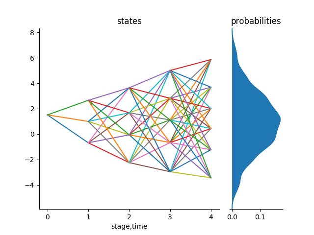

```@meta
CurrentModule = ScenTrees
```

# Kernel Density Estimation

This is a non-parametric technique for generating trajectories used to generate and improve scenario trees and scenario lattices in the stochastic approximation algorithm. It involves two steps:

    1. Density estimation and,
    2. Stochastic approximation process.

In thit tutorial we will concentrate on the first step as stochastic approximation process is already discussed in the previous tutorial. 

For the density estimation step, we have an `(N x T)` data from some observed trajectories of a scenario process and we want to use the conditional density estimation to generate new but different sample based on the above trajectories. This process involves two steps:

    (a) Estimation of the distribution of conditional denstities and,
    (b) Composition method

We estimate the distribution of transition densities given the history of the process. This distribution is estimated by the non-parametric kernel density estimation. 

The generated data point is according to the distribution of the density at the current stage and dependent on the history of all the data points. It has been shown that the choice of the kernel does not have an important effect on density estimation. Hence, we employ the following logistic kernel in this paper $k(x) = \frac{1}{(e^x + e^{-x})^2}$ in default.

One of the most important factor to consider in density estimation is the bandwidth. We use the Silverman's rule of thumb to obtain the bandwidths for each of the data columns as follows 
$$h_N = \sigma(X_t)\cdot N^{\frac{-1}{N+4}}$$
where $N$ is the number of available trajectories and $\sigma(X_t)$ is the standard deviation of data in stage $t$.

The new sample path $\mathbf{\tilde{\xi_T}}$ is what we will feed in the stochastic approximation algorithm to generate a scenario tree or a scenario lattice.

## Implementation of the above process

The above process is implemented in our library in `KernelDensityEstimation.jl`.In this script, we use the concept of function closures which we assume that the user of this library is aware of. The user is required to provide a data in 2 dimension, i.e., a matrix of Float64 or Int64, to this function and also the distribution of the kernel that he/she wants to use. The default kernel distribution is the Logistic kernel. The kernel distribution should conform to the distributions stated in [Distributions.jl](https://github.com/JuliaStats/Distributions.jl) library. 

Most of the times when you load the data into Julia, it recognizes it as a `DataFrame` type. But we have wrote the function in a manner that the user should provide a Matrix of either floats or integres. In the following procedure, we use the function `Matrix` to convert the loaded dataframe into a matrix which is the right type of input into the function.

The function `KernelScenarios(data::Union{Array{Int64,2},Array{Float64,2}}, kernelDistribution = Logistic)` takes a $(N \times T)$ dimensional data and the distribution of the kernel you want to employ. The $N$ rows of the data are the number of trajectories in the initial data and the $T$ columns is the number of stages in in each trajectory of the data. Since `TreeApproximation!` and `LatticeApproximation` function needs a process function for generating samples that doesn't take any inputs, we employ the concept of function closures inside the above function. The function `KernelScenarios(data,kernelDistribution)` is a getfield type of a function closure and so is sufficient to be a function required for stochastic approximation process.

To confirm the above statement, consider a `1000x5` dimsneional data from random walk. What is important to be said is that we use the package `CSV`^[https://github.com/JuliaData/CSV.jl] to read the data into julia and since we need the data in matrix form, we use the function `Matrix` from the package `DataFrames`^[https://github.com/JuliaData/DataFrames.jl] to convert the dataframe into an array in two dimension which is then the input of our function.

```julia
julia> using ScenTrees, CSV
julia> data = CSV.read(".../RandomDataWalk.csv")
julia> Rdw = Matrix(data)
julia> Kdt = KernelScenarios(Rwd,Logistic)
(::getfield(ScenTrees, Symbol("#closure#52")){Array{Float64,2},Int64,Int64,Array{Float64,1},Array{Float64,1},Array{Float64,1}}) (generic function with 1 method)
julia> ExampleTraj = KernelScenarios(Rwd,Logistic)()
5-element Array{Float64,1}:
  2.9313349319144413
 -2.096361853760116 
  3.767121571013698 
  2.147647884035623 
  0.9424061566897852
```

As in `ExampleTraj`, this function returns is a new sample according to the distribution of the density at the current stage and dependent on the history of all the data points. 

We use the above data to approximate a scenario lattice in 5 stages with a braching structure of $(1\times 3\times 4\times 5\times6)$  and $100,000$ number of iterations as follows:

```julia
julia> KernExample = LatticeApproximation([1,3,4,5,6],KernelScenarios(Rwd,Logistic),100000);
julia> PlotLattice(KernExample)
```

The above plot function gives the following plot result:



