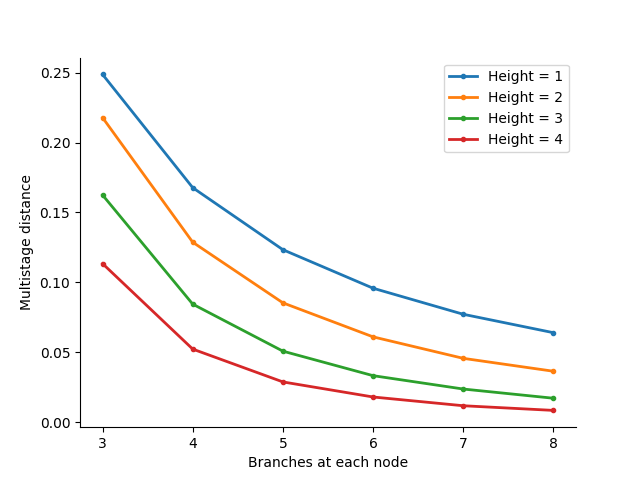

```@meta
CurrentModule = ScenTrees
```

# Performance of `ScenTrees.jl`

`ScenTrees.jl` was built with a goal of employing the speed of Julia. This package's design allows us to obtain a fast code with high flexibility and excellent computational efficiency. The design choices are highly motivated by the properties of the Julia language.

The most important concept in Julia is multiple dispatch i.e., the ability to dispatch function calls to different methods depending on the type of all function arguments. Julia arrays are first class objects and linear algebra functions have been integrated into the language standard library hence making it easier for the development of this library.

## Computational time for trees of different heights

It is important to note that a scenario tree converges in probability for more and more samples that you generated to improve the tree, i.e., if you perform more iterations then you will get a scenario tree that has a better approximation quality than when you perform less iterations.

One other thing that comes into play for the approximation quality of the scenario tree is the bushiness of the tree. It turns out that having a bushy branching structure produces a scenario tree that has a better approximation quality than a tree with less bushy branching structure. Also, the height of the tree plays a big role on the approximation quality of the scenario tree. Higher trees have a better approximation quality than shorter trees. If we combine these two factors (bushiness and height of the tree), we get a tree which has the best approximation quality of the stochastic process in consideration. The multistage distance converges to ``0`` as the bushiness of the scenario tree increases. The convergence of the multistage distance holds in probability.

The table below shows the multistage distance of trees of different heights with an increasing branching structure:

|Branches   | Height = 1 | Height = 2 | Height = 3 | Height = 4 |
|-----------|------------|------------|------------|------------|
| 3 | 0.24866 | 0.2177  | 0.16245 | 0.11346 |
| 4 | 0.16805 | 0.12861 | 0.08451 | 0.05236 |
| 5 | 0.12333 | 0.08559 | 0.05073 | 0.0289  |
| 6 | 0.09561 | 0.06042 | 0.03345 | 0.01913 |
| 7 | 0.07752 | 0.04562 | 0.02333 | 0.01188 |
| 8 | 0.06401 | 0.03547 | 0.01711 | 0.00855 |

The above table can be represented in a plot as follows:



The above plot can be obtained by calling the function `bushinessNesDistance()` from the package.

Generally, the approximating quality of a scenario tree increases with increasing height of the tree and increasing bushiness of the tree.

## Comparison with implementation in MATLAB

In order to see how fast Julia is, we compared the run-time performance of different trees with different heights with the same algorithm written in MATLAB programming language. We run the same trees and saved the time it takes to produce results. The following table shows the results (N/B: The time shown is in seconds):

| Tree           | Number of Iterations | Run-time (Julia) | Run-time (MATLAB) | Speed of Julia |
|----------------|----------------------|--------------|---------------|-------------------|
|1x2x2| 10,000| 0.17 | 6.75 | 38.9 times |
|1x2x2x2| 10,000 | 0.16 | 9.74 | 59.8 times |
|1x2x2x2| 100,000 | 1.77 | 111.73 | 63.1 times |
|1x2x4x8| 100,000 | 2.31 | 184.11 | 79.7 times |
|1x2x3x4x5| 1,000,000| 23.15 | 1955.66 | 84.5 times |
|1x3x3x3x2| 1,000,000| 20.12 | 1652.92 | 82.2 times |
|1x3x3x3x3| 1,000,000| 21.44 | 1752.40  | 81.7 times |
|1x10x5x2 | 1,000,000| 23.96 | 2046.88 | 85.4 times |
|1x3x4x4x2x2| 1,000,000 | 27.36 | 2211.54 | 80.8 times |


What is clear is that `ScenTrees.jl` library outperforms MATLAB for all the scenario trees. Also, it is important to see that `ScenTrees.jl` performs pretty faster for scenario trees which are bushy and has different heights.

The crucial factor that leads to such high speed of computation in Julia is:

  - Julia is a multiple dispatch language. Its core design, _type-stability through specialization via multiple dispatch_ is what allows Julia to be very easy for a compiler to make into efficient code, but also allows the code to be very concise and "look like a scripting language". This will lead to some very clear performance gain. Type stability is the idea that there is only one possible type that can be outputted from a method. If a function is type-stable, then the compiler can know what type will be at all points in the function and smartly optimize it to the same assembly as C/Fortran.

Our library totally relies on the above feature. That is why we were able to attain a speed of approximately 80 times than MATLAB.

## Development and Testing

`ScenTrees.jl` was developed in Julia 1.0.4 and tested using the standard Julia framework. It was tested for Julia versions 1.0,1.1,1.2 and nightly for the latest release of Julia in Linux and OSX distributions.

The comparison done for this library in Julia 1.0.4 and MATLAB R2019a was done on Linux(x86_64-pc-Linux-gnu) with CPU(TM) i5-4670 CPU @ 3.40GHz.

What is more important for testing and development is the processor speed for your machine. Machines with low processors will take longer time to execute the functions than machines with high processors. Hence, depending on the type of processor you have, you may or may not or even pass the computational speed that we achieved for this library.

!!! tip
    This library is actively developed and new features and improvements are constantly and continuously added. So, before using it, make it an habit to update your packages.

This ends our tutorials for using `ScenTrees.jl`. You are now ready to generate scenario trees and scenario lattices depending on what you want to approximate.
